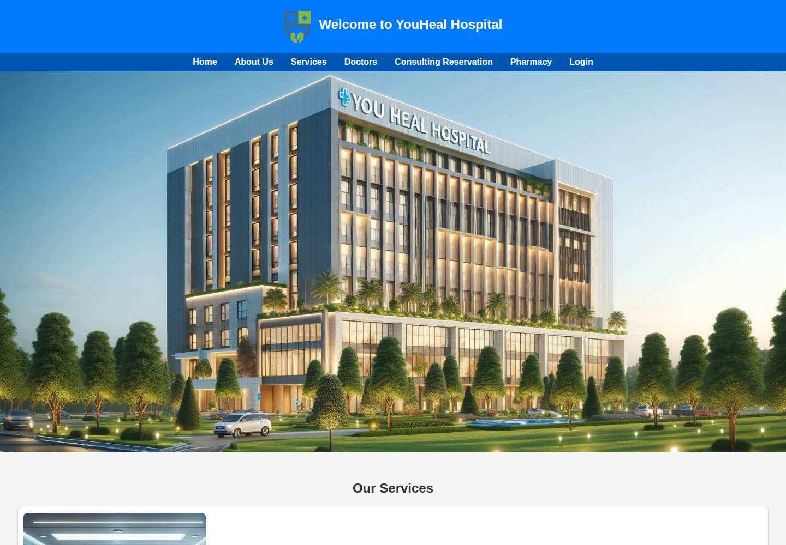
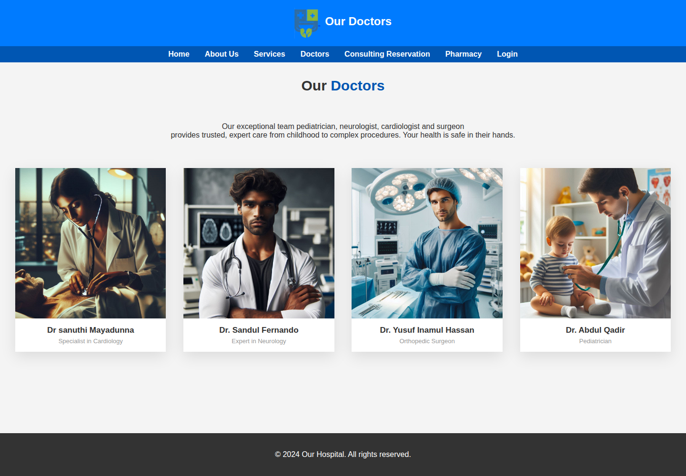
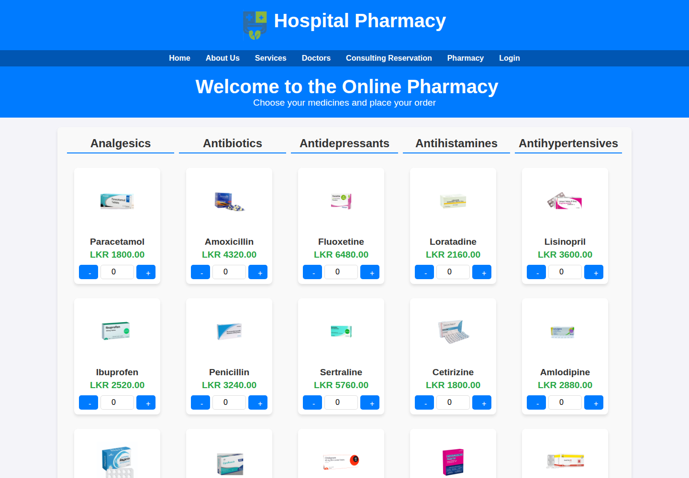
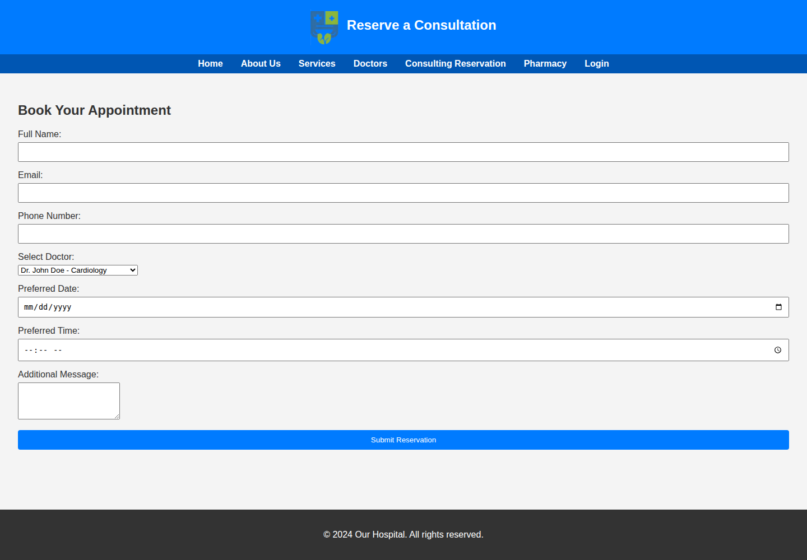

<div align="center">

# YouHeal Hospitals

### A responsive hospital website built with HTML, CSS and vanilla JavaScript.

A multi-page front-end coursework project covering hospital services, doctors, pharmacy browsing, consultation reservations, account screens and payment UI.

[**Live Site**](https://t0t0r0-byte.github.io/WDOS-Assignment/) · [**Source Code**](https://github.com/T0T0R0-byte/WDOS-Assignment)


</div>

---

## Overview

YouHeal Hospitals is a fictional patient-facing hospital website designed as a web development coursework project.

The site brings common patient journeys into one interface:

- discover hospital information and services
- browse doctors and specialisations
- explore pharmacy products
- reserve a consultation
- access login and payment interfaces

The project is built without a framework or build system, keeping the implementation focused on core web technologies.

## Product Showcase

### Home



### Doctors



### Pharmacy



### Consultation Reservation



## Pages

| Page | Purpose |
| --- | --- |
| [Home](https://t0t0r0-byte.github.io/WDOS-Assignment/) | Hospital overview and service navigation |
| [About Us](https://t0t0r0-byte.github.io/WDOS-Assignment/about_us.html) | Hospital information |
| [Doctors](https://t0t0r0-byte.github.io/WDOS-Assignment/doctors_page.html) | Doctor profiles and specialisations |
| [Services](https://t0t0r0-byte.github.io/WDOS-Assignment/services_page.html) | Service categories |
| [Pharmacy](https://t0t0r0-byte.github.io/WDOS-Assignment/pharmacy_page.html) | Pharmacy catalogue |
| [Consultation](https://t0t0r0-byte.github.io/WDOS-Assignment/consulting_reservation_page.html) | Consultation booking interface |
| [Login](https://t0t0r0-byte.github.io/WDOS-Assignment/login_page.html) | Account interface |
| [Payment](https://t0t0r0-byte.github.io/WDOS-Assignment/payment.html) | Payment interface |

## Tech Stack

HTML5 · CSS3 · Vanilla JavaScript · GitHub Pages

## Project Structure

```text
.
├── index.html
├── about_us.html
├── doctors_page.html
├── services_page.html
├── pharmacy_page.html
├── consulting_reservation_page.html
├── login_page.html
├── payment.html
├── css/
├── js/
├── images/
└── docs/
    └── screenshots/
```

## Run Locally

No package installation is required.

```bash
git clone https://github.com/T0T0R0-byte/WDOS-Assignment.git
cd WDOS-Assignment
python -m http.server 8000
```

Open http://localhost:8000 in your browser.

## Project Notes

This is a front-end coursework implementation. The login, consultation and payment pages are interface prototypes. Authentication, persistent booking storage and payment processing are not backed by a production server.

<div align="center">

Built for web development coursework.

</div>
